# HYBpy — Hybrid Modeling Framework

**User Manual and Local Execution Guide**  
**Version 1.2 (2025)**

**Authors:** José Pedreira, Rafael Costa, José Pinto, Rui Oliveira  
**Developed at:** UCIBIO – Applied Molecular Biosciences Unit, NOVA School of Science and Technology, Universidade NOVA de Lisboa, Portugal

---

## 1. Introduction

HYBpy is a hybrid modeling framework designed for the construction, training, and evaluation of hybrid models that combine mechanistic knowledge with machine learning techniques. The framework targets applications in bioprocess engineering and biological systems, where partial mechanistic knowledge can be complemented by data-driven components.

HYBpy is available as a web-based application at **www.hybpy.com** and can also be executed locally using a dedicated **Local Trainer**. This document describes how to install, configure, and use HYBpy locally, as well as how to interact with the web interface.

---

## 2. System Architecture Overview

HYBpy consists of three main components:

1. **Web interface**  
   Provides project creation, configuration, monitoring, and result visualization.

2. **Training backend**  
   Executes model training and evaluation either remotely (cloud execution) or locally.

3. **Local Trainer**  
   A lightweight HTTP service that runs on the user’s machine and performs training locally when selected.

The Local Trainer allows users to bypass cloud execution while maintaining full compatibility with the HYBpy web interface.

---

## 3. Local Execution Using Pre-built Executables (Recommended)

HYBpy provides pre-built executables for Windows and macOS that allow local execution without requiring a Python installation.

### 3.1 Windows Local Trainer

The Windows Local Trainer is distributed as a ZIP archive containing a single executable.

**Steps:**

1. Download the Windows package from the **latest GitHub release**.
2. Extract the ZIP file to a folder of your choice.
3. Run the executable by double-clicking it or executing it from PowerShell:

```powershell
.\HYBpy_LocalTrainer.exe
```

When the Local Trainer starts successfully, a console window will open and display initialization messages.

On first execution, you may see a message indicating that Matplotlib is building the font cache. This is expected and only occurs once.

The Local Trainer is ready when the console displays a message:

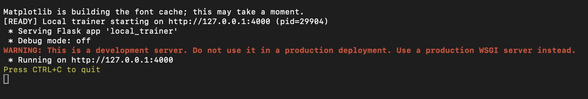

At this point, the service is running and ready to accept training requests from the web interface.

### 3.2 macOS Local Trainer

The macOS Local Trainer is available for both Apple Silicon (M1/M2/M3/M4) and Intel-based Macs.

**Steps:**

1. Download the appropriate macOS package from the latest GitHub release.
2. Extract the ZIP file.
3. Open a terminal in the extracted directory.
4. Make the executable runnable if necessary and execute it by double-clicking or running:

```bash
chmod +x HYBpy_LocalTrainer
./HYBpy_LocalTrainer
```

If macOS blocks the application due to security restrictions, the user must explicitly allow execution via System Settings → Privacy & Security.

Once running, the console output will indicate readiness in the same way as on Windows:


## 4. Local Trainer Behavior and Lifecycle

The Local Trainer runs a lightweight HTTP server on the local machine, typically bound to:

```text
http://127.0.0.1:4000
```

Once started, the service remains active until manually terminated by the user. The console window must remain open for the service to continue running.

- The Local Trainer performs the following tasks:
- Receives training requests from the HYBpy web interface
- Downloads project files and datasets
- Executes model training and evaluation locally
- Uploads results, plots, and trained models back to the HYBpy backend

## 5. Running HYBpy from Source (Developer Setup)

Advanced users may choose to run HYBpy from source using a Python environment. This option is recommended for developers or users who wish to modify the codebase.

### Step 1: Obtain the HYBpy Repository

First, you need to get the HYBpy code onto your computer. There are two primary methods for doing this:

- **Using Git:** Clone the repository directly from GitHub using the command line. This is the recommended method as it makes it easier to update the code in the future.

    ```bash
    git clone https://github.com/joko1712/HYBpy.git
    ```

- **Downloading a ZIP file:** Alternatively, you can download the repository as a compressed file from the GitHub page. Navigate to `github.com/joko1712/HYBpy` and click on the "Code" button, then select "Download ZIP."

Once you have the code, use your terminal or command prompt to navigate into the project's root directory.

```bash
cd HYBpy
```

---

## Option 1 — Using Python Virtual Environment (venv)

### Step 2: Create a Virtual Environment

To avoid conflicts with other Python projects and their dependencies, it's best practice to create a dedicated **virtual environment**. This isolates the project's required packages.

Use the following command to create a new virtual environment named `HYBpyEnv`:

```bash
python -m venv HYBpyEnv
```

---

### Step 3: Activate the Virtual Environment

Before installing any packages, you must **activate** the virtual environment. The commands differ slightly based on your operating system:

- **Windows:**

    ```bash
    HYBpyEnv\Scripts\activate
    ```

- **macOS / Linux:**

    ```bash
    source HYBpyEnv/bin/activate
    ```

You'll know the environment is active when the name `(HYBpyEnv)` appears at the beginning of your command prompt.

---

### Step 4: Install Required Packages

With the virtual environment active, you can now install all the necessary dependencies. It's a good practice to first upgrade `pip` (the package installer) to its latest version.

```bash
pip install --upgrade pip
```

Next, install the required libraries. This can be done with a single command:

```bash
pip install numpy scipy matplotlib torch scikit-learn h5py torchdiffeq pandas
```

---

### Step 5: Run the tool

After installing the dependencies, you can run the tool using the following command:

```bash
python run_hybtrain_local.py
```

---

### Step 6: Deactivate the Virtual Environment

Once you are finished working on the project, you should deactivate the virtual environment. This will return you to your system's global Python environment.

```bash
deactivate
```

---

## Option 2 — Using Conda Environment

### Step 2: Create a Conda Environment

If you prefer Conda (Anaconda or Miniconda), you can create an isolated environment with Python 3.10 or later:

```bash
conda create -n hybpy python=3.10
```

### Step 3: Activate the Conda Environment

Activate the newly created Conda environment:

```bash
conda activate hybpy
```

### Step 4: Install Required Packages

Install the necessary packages using Conda and pip:

```bash
conda install numpy scipy matplotlib scikit-learn pandas h5py pytorch -c pytorch
pip install torchdiffeq
```

### Step 5: Run the tool

After installing the dependencies, you can run the tool using the following command:

```bash
python run_hybtrain_local.py
```

### Step 6: Deactivate the Conda Environment

When you are done working, you can deactivate the Conda environment:

```bash
conda deactivate
```

---

## 6. Web Interface Usage (Help / Guide)

The HYBpy web interface provides a guided workflow for creating, configuring, and executing hybrid model training runs. All configuration steps are performed through the browser, while computation can be executed either on the HYBpy cloud infrastructure or locally using the Local Trainer.

### 6.1 Step 1 — Navigate to “New Project”

From the navigation menu, go to New Project. This page allows you to create a training project by uploading your model and dataset.

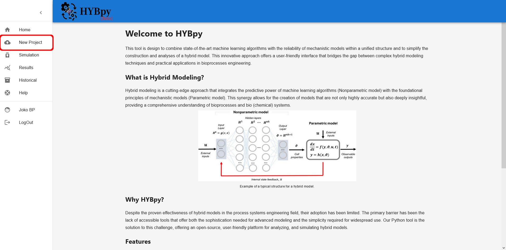

### 6.2 Step 2 — Set Project Title

Set a title for your project. This title will be used to identify the run in the historical list.

After setting the title, proceed to file selection.

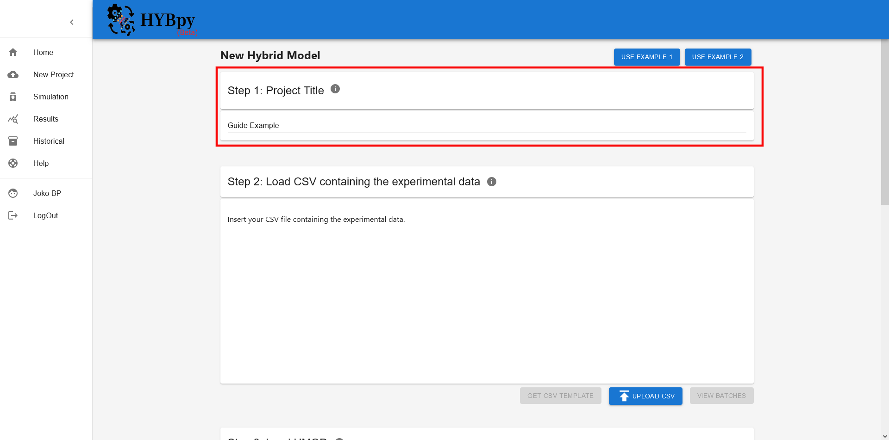

### 6.3 Step 3 — Choose File Source

Choose whether you will use:

- Your own files, or
- Example files from the website

### 6.4 Workflow A — Using Your Own Files

#### 6.4.1 Step 3 — Upload Data File (CSV)

Upload your dataset by clicking Upload CSV.
The dataset must be in .csv format.

If you are unsure about the format, download a template using Get CSV Template.

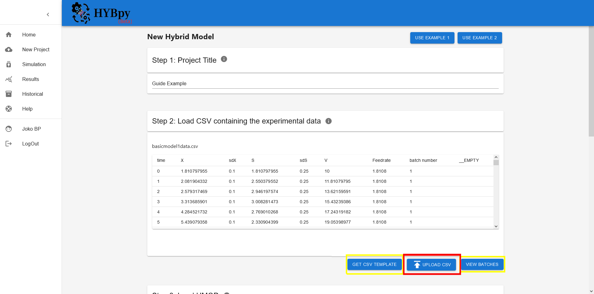

After uploading, you can click View Batches to visualize and confirm the uploaded batches.

#### 6.4.2 Step 4 — Upload Model File (HMOD) or Convert SBML

After uploading the CSV, you must provide the model definition. Choose one of the following:

- I have my own HMOD file, or
- I have an SBML file

### 6.5 Workflow A1 — I Have an HMOD File

#### 6.5.1 Step 4 — Upload HMOD

Upload the model file using Upload HMOD.

If you are unsure about the structure of the HMOD file, download a template using Get HMOD Template.

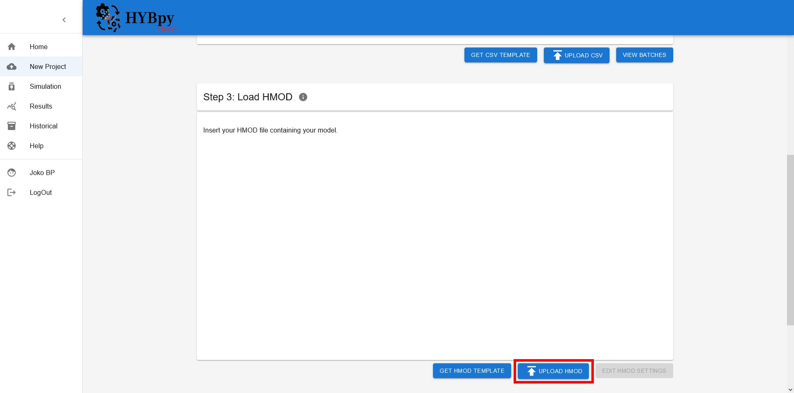

After uploading, HYBpy will validate the HMOD structure.
If the file does not contain an ML component (MLM), the interface will guide you through adding it.

#### 6.5.2 Step 4.1 — Add Control Variables (If MLM Is Missing)

If your HMOD file does not include an MLM section, a setup popup appears.

First, select which variables will be used as control variables.

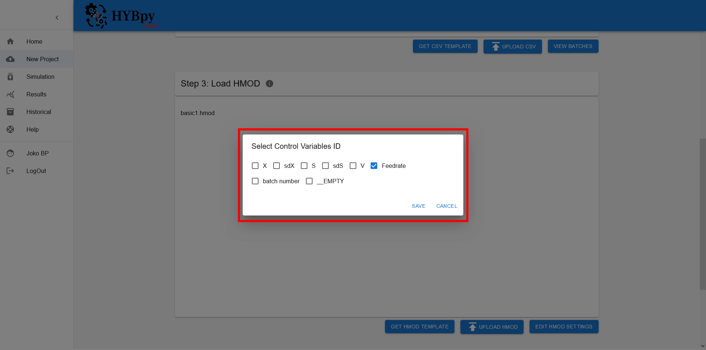

#### 6.5.3 Step 4.2 — Set Network Inputs and Outputs (If MLM Is Missing)

Next, define the network configuration:

- Number of inputs and their variables
- Number of outputs and their variable

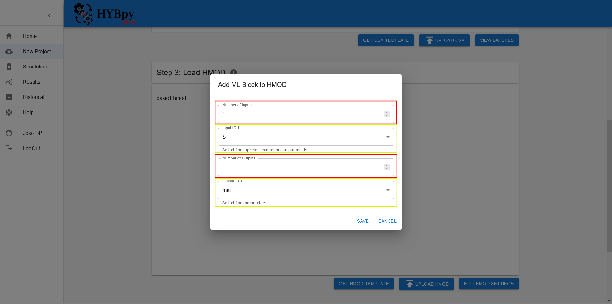

#### 6.5.4 Step 5 — Verify and Modify MLM Settings

After the model is uploaded (and MLM is present or created), you can review and modify ML settings via Edit HMOD Settings.

The settings popup contains:

- Main MLM configuration parameters
- Advanced settings (recommended to leave unchanged unless you know the implications)

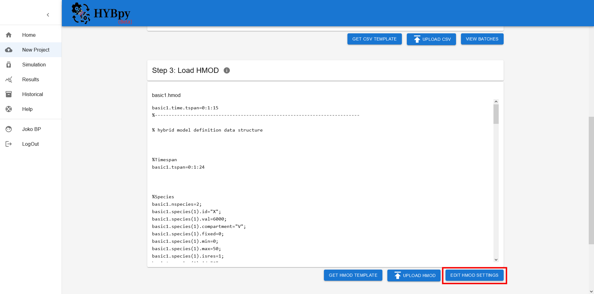

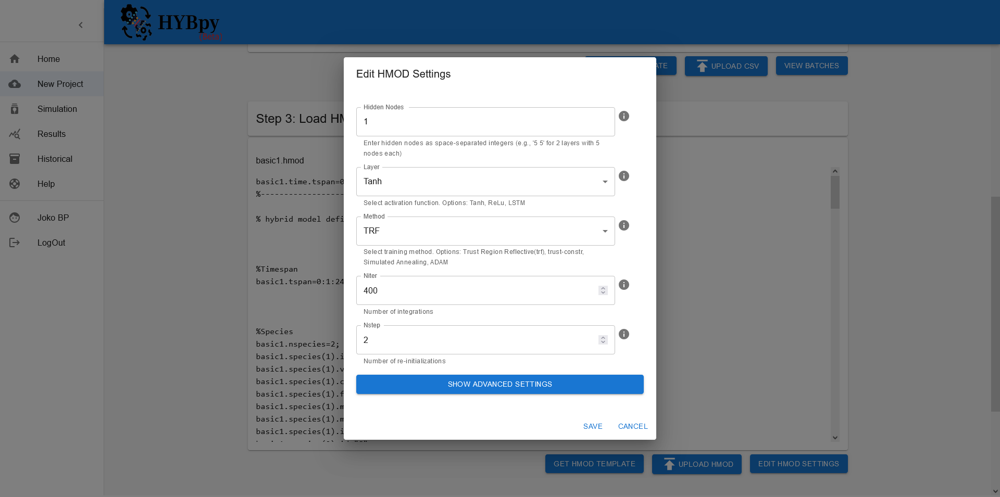

#### 6.5.5 Step 6 — Select Batch Selection Method

Once the CSV and HMOD are ready, select how batches are assigned:

- Manual Hold-Out Cross Validation

    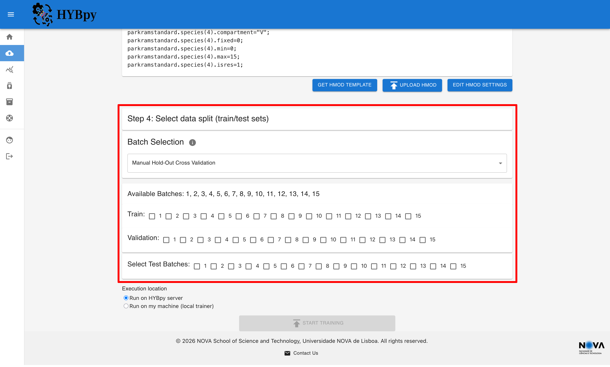

- Automatic Hold-Out Cross Validation

    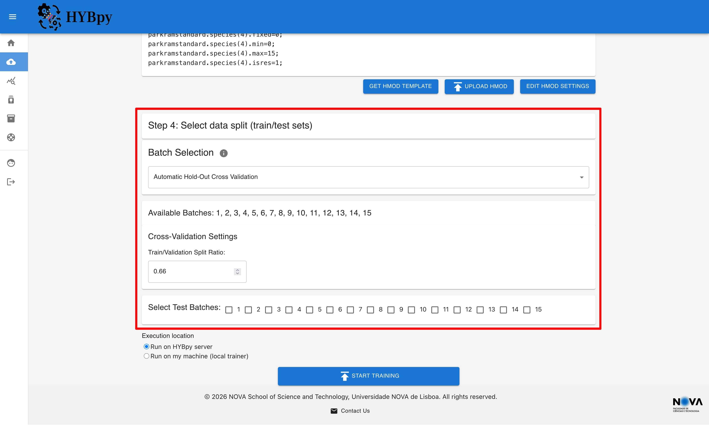

- K-Fold Cross Validation

    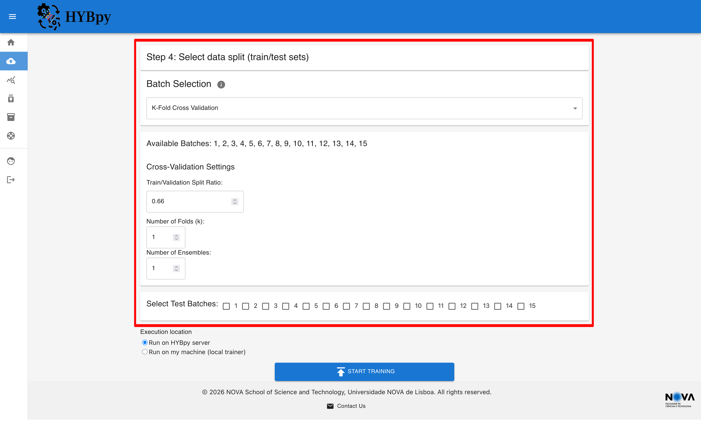

#### 6.5.6 Step 7 — Create Training Run

When files are uploaded, settings are configured, and batches are selected, select the location of the training execution:

- Run on HYBpy Cloud (default)
- Run on my machine (local trainer)


Finally, click Start Training to start the run.

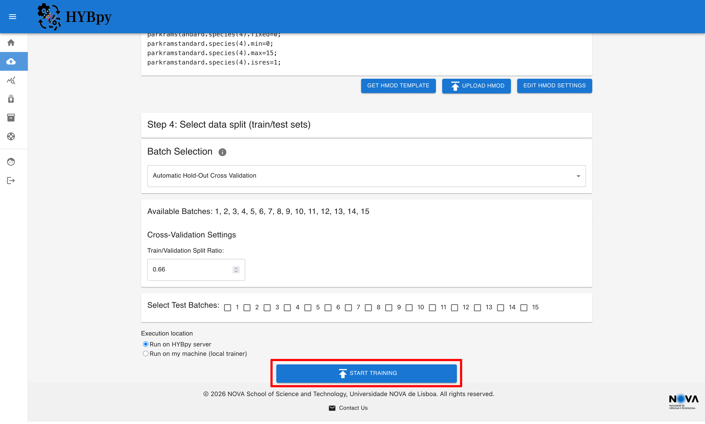

### 6.6 Workflow A2 — I Have an SBML File

If you have an SBML model, you must first convert it to HMOD using the SBML2HYB tool.

#### 6.6.1 Step 4 — Download SBML2HYB

Download SBML2HYB:

Windows: https://figshare.com/ndownloader/files/38688132

macOS: https://figshare.com/ndownloader/files/38688432

#### 6.6.2 Step 4.1b — Translate SBML File

Run SBML2HYB and click Translate SBML File, then select your SBML file.

After downloading the SBML2HYB tool you can convert the SBML file to a HMOD file by running the tool and clicking the button "Translate SBML File" and select the SBML file.

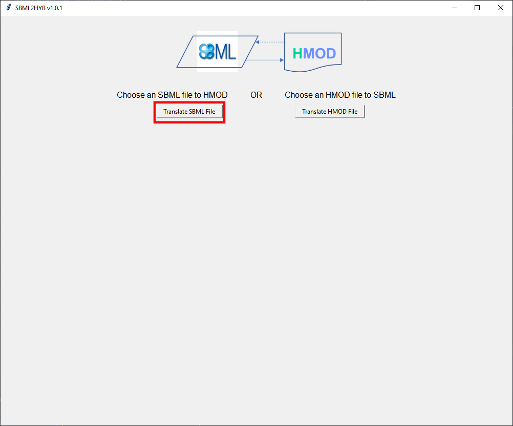

After converting the SBML file to a HMOD file, save it and upload it to the HYBpy web interface.

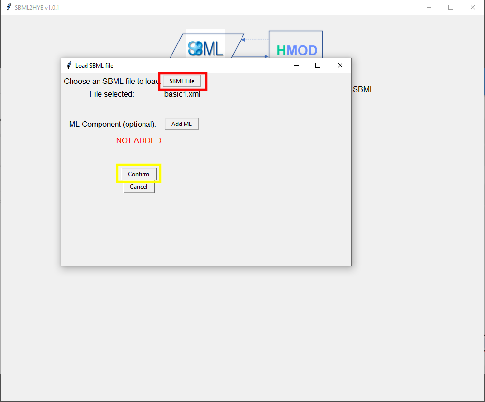

#### 6.6.3 Step 4.2b — Save Generated HMOD and Upload to HYBpy

After conversion, save the generated .hmod file and upload it in HYBpy.

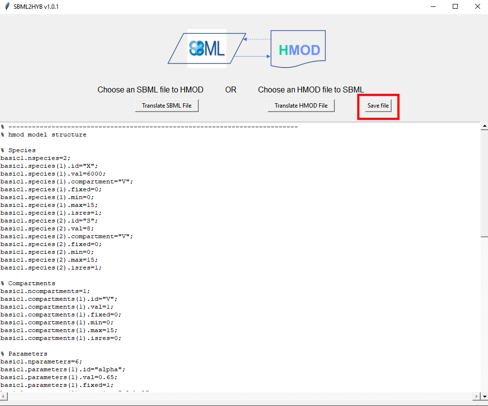

#### 6.6.4 Step 4.1 — Add Control Variables (If MLM Is Missing)

If your HMOD file does not include an MLM section, a setup popup appears.

First, select which variables will be used as control variables.


#### 6.6.5 Step 4.2 — Set Network Inputs and Outputs (If MLM Is Missing)

Next, define the network configuration:

- Number of inputs and their variables
- Number of outputs and their variable


#### 6.6.6 Step 5 — Verify and Modify MLM Settings

After the model is uploaded (and MLM is present or created), you can review and modify ML settings via Edit HMOD Settings.

The settings popup contains:

- Main MLM configuration parameters
- Advanced settings (recommended to leave unchanged unless you know the implications)


#### 6.6.7 Step 6 — Select Batch Selection Method

Once the CSV and HMOD are ready, select how batches are assigned:

- Manual Hold-Out Cross Validation

    

- Automatic Hold-Out Cross Validation

    

- K-Fold Cross Validation

    

#### 6.6.8 Step 7 — Create Training Run

When files are uploaded, settings are configured, and batches are selected, select the location of the training execution:

- Run on HYBpy Cloud (default)
- Run on my machine (local trainer)


Finally, click Start Training to start the run.


### 6.7 Workflow B — Using Example Files

If you do not have your own files, you can use the example datasets available on the website.

#### 6.7.1 Step 3 — Select Example

Select one of the available examples.

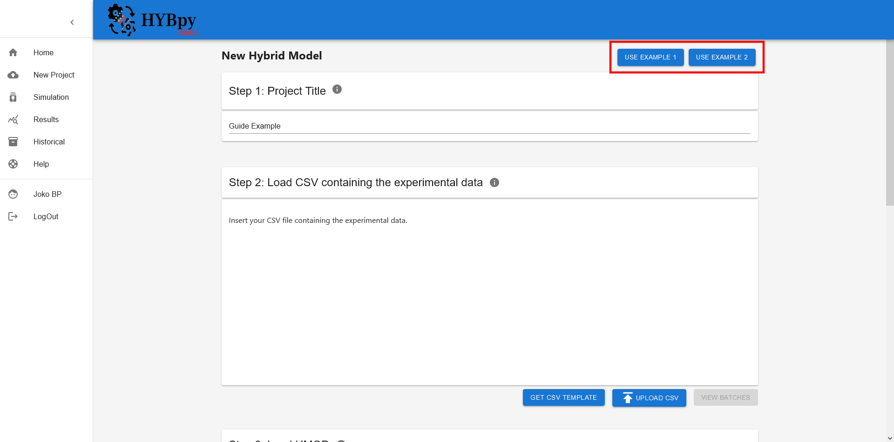

#### 6.7.2 Step 4 — Verify Data (View Batches)

After selecting an example, click View Batches to visualize and verify the dataset.

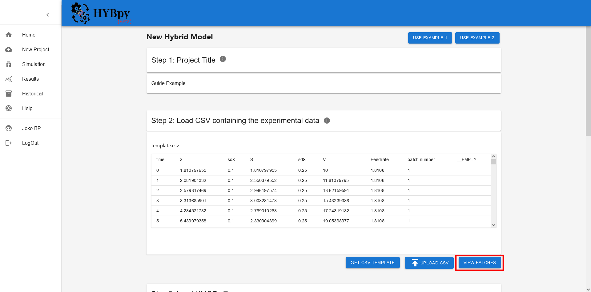

#### 6.7.3 Step 5 — Verify and Modify ML Settings

You can review or modify the MLM settings via Edit HMOD Settings.


#### 6.7.4 Step 6 — Select Batch Selection Method

Once the CSV and HMOD are ready, select how batches are assigned:

- Manual Hold-Out Cross Validation

    

- Automatic Hold-Out Cross Validation

    

- K-Fold Cross Validation

    

#### 6.7.5 Step 7 — Create Training Run

When files are uploaded, settings are configured, and batches are selected, select the location of the training execution:

- Run on HYBpy Cloud (default)
- Run on my machine (local trainer)


Finally, click Start Training to start the run.


---

## Developed at

- HYBpy is developed and maintained at UCIBIO - Applied Molecular Biosciences Unit, NOVA School of Science and Technology, Universidade NOVA de Lisboa, 2829-516 Caparica, Portugal

_Authors:_ [José Pereira](https://github.com/joko1712), [Rafael Costa](https://github.com/r-costa), José Pinto, Rui Oliveira

---

## Publication

If you use HYBpy in academic work, please cite:

Pedreira, J., Pinto, J., Gonçalves, D., Barahona, P., Oliveira, R., & Costa, R. S. (2025).
_HYBpy: A web-based framework for hybrid modeling of biological systems_.
Digital Chemical Engineering, 17, 100278. https://doi.org/10.1016/j.dche.2025.100278

### BibTeX

```bibtex
@article{Pedreira2025HYBpy,
  title   = {HYBpy: A web-based framework for hybrid modeling of biological systems},
  author  = {Pedreira, Jos{\'e} and Pinto, Jos{\'e} and Gon{\c{c}}alves, Daniel and Barahona, Pedro and Oliveira, Rui and Costa, Rafael S.},
  journal = {Digital Chemical Engineering},
  volume  = {17},
  pages   = {100278},
  year    = {2025},
  month   = {12},
  doi     = {10.1016/j.dche.2025.100278}
}
```

## License

This work is licensed under a <a href="https://www.gnu.org/licenses/gpl-3.0.html"> GNU Public License (version 3.0).</a>
